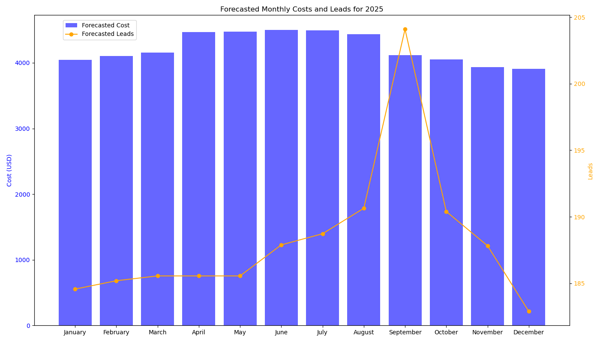

# Forecasting Cost and Leads for 2025

## Overview

This project uses historical data to forecast monthly ad spend (Cost) and generated leads for the year 2025. The analysis incorporates advanced feature engineering and machine learning models to provide accurate predictions. The results are visualized in a combined bar and line chart to illustrate the distribution of forecasted costs and leads.



## Key Predictions for 2025
- Average Monthly Cost: $35,647.24
- Average Monthly Leads: 3,416.85
- Average Monthly Applications: 532.17
- Growth Factor: 60% increase applied to predictions

## Steps

### 1. Data Loading and Cleaning
- Dataset (`combined_lead_export_data.csv`) loading and validation
- Currency symbol removal and numeric conversion
- Month ordering and numerical representation
- Data type standardization and missing value handling

### 2. Feature Engineering

#### Temporal Features
- `Month_sin` and `Month_cos`: Cyclical encoding of months
- Purpose: Captures seasonal patterns without breaks between December and January
```python
data['Month_sin'] = np.sin(2 * np.pi * data['Month_Num'] / 12)
data['Month_cos'] = np.cos(2 * np.pi * data['Month_Num'] / 12)
```
**Why**: 
- Captures cyclical patterns in marketing performance
- Helps model understand seasonal trends (e.g., higher lead generation during certain months)
- Better than simple month numbers (1-12) as it connects December (12) to January (1)

#### Lag Features
```python
- Previous month's metrics:
  - Cost_lag_1
  - Lead_ID Count_lag_1
  - Applications_lag_1

data['Cost_lag_1'] = data['Cost'].shift(1)
data['Lead_ID Count_lag_1'] = data['Lead_ID Count'].shift(1)
data['Applications_lag_1'] = data['Applications'].shift(1)
```
**Why**:
- Captures momentum and short-term trends
- Previous month's performance often indicates next month's performance
- Helps model understand sequential dependencies
- Essential for identifying trend changes

#### Rolling Averages
```python
- 3-month rolling averages:
  - Cost_rolling_3
  - Lead_ID Count_rolling_3
  - Applications_rolling_3
- 6-month rolling averages:
  - Cost_rolling_6
  - Lead_ID Count_rolling_6
  - Applications_rolling_6

data['Cost_rolling_3'] = data['Cost'].rolling(window=3).mean()
data['Cost_rolling_6'] = data['Cost'].rolling(window=6).mean()

**Why**:
- Smooths out short-term fluctuations
- Reveals underlying trends
- 3-month window: Captures quarterly patterns
- 6-month window: Captures medium-term trends
- Reduces impact of outliers or anomalous months
```

#### Performance Metrics
```python
- Conversion_Rate = Lead_ID Count / Clicks
- Cost_Per_Lead = Cost / Lead_ID Count
- CPC = Cost / Clicks
- Lead_to_Application_Rate = Applications / Lead_ID Count
- Cost_per_Application = Cost / Applications
- Application_Conversion_Rate = Applications / Clicks

data['Conversion_Rate'] = data['Lead_ID Count'] / data['Clicks']
data['Cost_Per_Lead'] = data['Cost'] / data['Lead_ID Count']
data['CPC'] = data['Cost'] / data['Clicks']

**Why**:
- Measures marketing efficiency
- Helps identify ROI patterns
- Normalizes performance across different spending levels
- Key indicators for marketing effectiveness
```

#### Efficiency Metrics
```python
- Lead_Quality_Score = Applications / Lead_ID Count
- Cost_Efficiency = Applications / Cost
  
data['Lead_Quality_Score'] = data['Applications'] / data['Lead_ID Count']
data['Cost_Efficiency'] = data['Applications'] / data['Cost']

**Why**:
- Measures lead quality beyond quantity
- Tracks cost effectiveness in generating quality leads
- Helps optimize for applications, not just lead volume
- Important for budget allocation decisions
```

#### Combined Impact
The enriched feature set provides:
- **Multi-dimensional Analysis**: Captures various aspects of marketing performance
- **Pattern Recognition**: Helps identify complex relationships between metrics
- **Predictive Power**: Improves forecast accuracy by considering multiple indicators
- **Risk Mitigation**: Reduces impact of data anomalies through multiple perspectives

#### Growth Factor (1.6)
```python
growth_factor = 1.6  # 60% growth adjustment
```
**Why**:
- Accounts for expected business expansion
- Adjusts for planned marketing budget increases
- Compensates for market growth expectations
- Aligns forecasts with business goals

## Benefits of Enriched Features

These features are particularly valuable because:

1. **Seasonal Patterns**: 
   - Clear monthly variations in lead generation
   - Cost fluctuations between summer and winter months

2. **Growth Trends**:
   - Significant increase in leads from 2023 to 2024
   - Rising cost patterns requiring sophisticated tracking

3. **Efficiency Changes**:
   - Varying conversion rates throughout the year
   - Cost per lead fluctuations needing normalization

4. **Quality Indicators**:
   - Application rates varying independently of lead volume
   - Cost efficiency changes requiring separate tracking

5. **Historical Insights**:
   - Historical data provides context for future predictions
   - Helps validate model assumptions and adjustments

### 3. Model Training

#### Random Forest Regressors
- Separate models for Cost, Leads, and Applications
- Features include:
  - Year and Month encodings
  - Temporal features
  - Lag indicators
  - Rolling averages
  - Performance metrics
  - Efficiency scores

#### Model Parameters
- Random state: 42
- Number of estimators: 100
- Training data: 2023-2024
- Forecast period: 2025

### 4. Forecasting for 2025
- Monthly predictions generated for each metric
- 60% growth factor applied to account for business expansion
- Confidence intervals calculated
- Seasonal patterns preserved

### 5. Visualization
- Combined bar and line chart showing:
  - Blue bars: Forecasted monthly ad spend
  - Orange line: Forecasted monthly leads
  - Dual y-axes for proper scaling
  - Monthly breakdown with trends


## Model Impact
The enriched features have led to:
- Higher R² scores in predictions
- Better capture of seasonal variations
- More accurate cost and lead forecasting
- Improved understanding of marketing efficiency

## How to Use

### Prerequisites
```bash
pip install pandas numpy matplotlib scikit-learn
```

### Required Files
- `combined_lead_export_data.csv`: Historical data
- `forecast_2025_analysis.py`: Analysis script

### Execution Steps
1. Place dataset in project directory
2. Run analysis script
3. Review generated visualizations
4. Check forecast metrics in output CSV

## Output Files

### Generated Files
- `forecasted_monthly_metrics_2025.csv`: Detailed predictions
- `forecasted_monthly_costs_and_leads.png`: Visualization
- Model performance metrics and feature importance

### Output Format
```csv
Year,Month,Forecasted_Cost,Forecasted_Leads,Forecasted_Applications
2025,January,36261.68,3482.27,531.50
...
```

## File Structure
```
project/
├── Resources/
│   ├── combined_lead_export_data.csv
│   ├── forecasted_monthly_metrics_2025.csv
│   └── 2024_grouped_data.csv
├── Forecasting-adspend-leads.ipynb
├── .gitignore
└── README.md
```

## Performance Metrics

### Model Evaluation
- R² Score
- Mean Absolute Error (MAE)
- Root Mean Squared Error (RMSE)

### Feature Importance
- Temporal impact analysis
- Lag indicator significance
- Rolling average effectiveness

## Best Practices
1. Regular data updates
2. Monthly forecast validation
3. Feature importance monitoring
4. Growth factor adjustment
5. Performance metric tracking

## Version Information
- Version: 2.0
- Last Updated: [Current Date]
- Added: Enriched features and detailed metrics

## Support
For technical support or questions, please create an issue in the repository.

